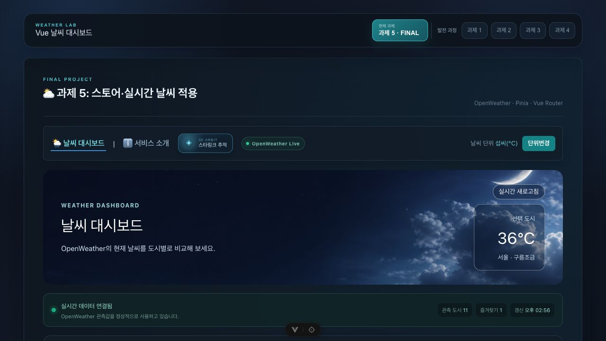
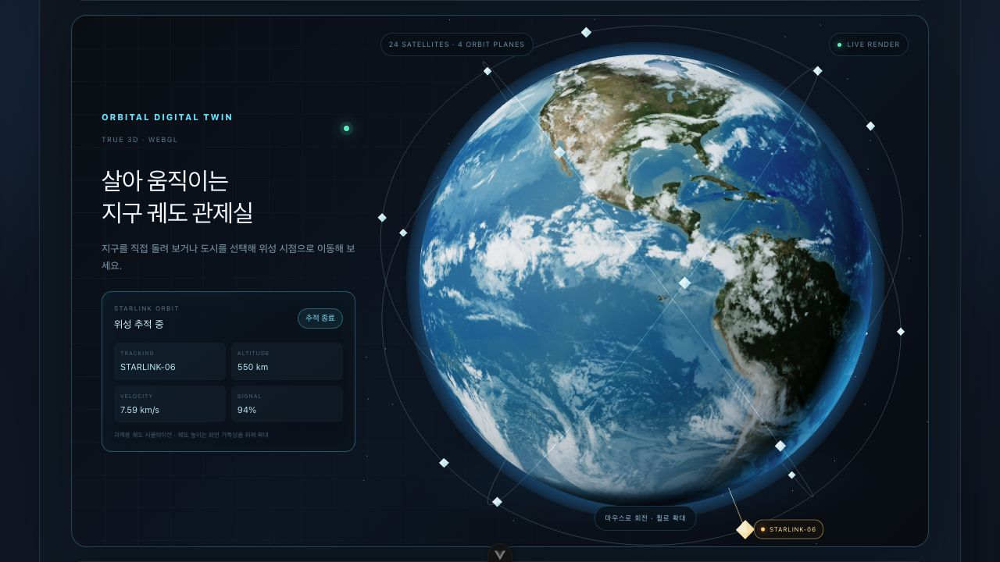

# Vue 날씨 대시보드

4일 동안 Vue.js의 기본 문법부터 컴포넌트 분리, Router, Pinia, Axios까지 단계별로 발전시킨 날씨 대시보드입니다. 과제 5를 메인 화면으로 사용하며, 상단의 발전 과정 탭에서 과제 1~4도 확인할 수 있습니다.

## 링크

- GitHub 저장소: https://github.com/piso7/skala-vue
- Vercel 배포: 배포 완료 후 주소 추가

## 화면

### 실시간 날씨 대시보드



### 3D 지구와 스타링크 궤도 시뮬레이션



## 구현 기능

- `ref`를 이용한 검색어, 선택 도시, 날씨 목록 등의 반응형 상태 관리
- `computed`를 이용한 도시 검색, 지역 필터링, 즐겨찾기 우선 정렬
- `watch`와 `watchEffect`를 이용한 선택 상태 및 검색어 변경 확인
- `WeatherParent`, `BaseDashboardCard`, `SearchBar`, `WeatherCard` 컴포넌트 분리
- `props`와 `emit`을 이용한 부모·자식 컴포넌트 데이터 전달
- Vue Router를 이용한 날씨 목록, 서비스 소개, 도시 상세 화면 이동
- Pinia를 이용한 즐겨찾기와 섭씨·화씨 단위 전역 관리
- Axios와 OpenWeather API를 이용한 11개 도시 실시간 날씨 조회
- API 요청 중 로딩 상태, 요청 실패 메시지, 기본 데이터 대체 처리
- Element Plus 적용 및 온도 단위 변경 UI 구성
- 국내·해외 도시 선택, 다중 선택, 도시 이름 검색
- 즐겨찾기 도시 상단 고정 및 브라우저 저장
- 날씨별 카드 배경과 마우스 오버 애니메이션
- 폭염 도시의 불지옥 트랙과 폭염 경보 모션
- 비·폭풍우 도시의 물지옥 트랙과 폭풍우 체험 모션
- 2D 지구 도시 이동, 자동 회전, 마우스 드래그
- Three.js 기반 3D 지구, 도시 좌표 이동, 스타링크 궤도 시뮬레이션
- 과제 1~4 발전 과정을 메인 화면에서 다시 확인하는 탭

> 스타링크 위치와 궤도 수치는 실제 위성 API가 아닌 과제용 화면 시뮬레이션입니다.

## 실행 방법

### 1. 프로젝트 설치

```sh
npm install
```

### 2. OpenWeather API 키 설정

프로젝트 최상위 폴더에 `.env.local` 파일을 만들고 아래 내용을 입력합니다.

```env
VITE_OPENWEATHER_API_KEY=발급받은_API_키
```

API 키가 없거나 요청이 실패하면 화면이 멈추지 않고 기존 기본 날씨 데이터를 표시합니다.

### 3. 개발 서버 실행

```sh
npm run dev
```

### 4. 배포용 빌드 확인

```sh
npm run build
npm run preview
```

## 주요 파일 구조

```text
src/
├── components/exercise/
│   ├── WeatherParent.vue       # 대시보드 상태와 전체 기능 연결
│   ├── BaseDashboardCard.vue   # slot을 사용하는 공통 카드
│   ├── SearchBar.vue           # 검색어 입력과 emit
│   ├── WeatherCard.vue         # 도시별 날씨 카드와 emit
│   ├── EarthGlobe.vue          # 2D 지구
│   └── EarthGlobe3D.vue        # Three.js 3D 지구와 위성 궤도
├── router/index.js             # 목록·소개·상세 라우트
├── stores/                     # 즐겨찾기와 온도 단위 전역 상태
└── views/                      # 과제 4·5의 목록·상세·소개 화면
```

## 4일간 어려웠던 점과 해결 과정

### 1일차 — 반응형 상태와 필터링

처음에는 검색 결과와 선택 결과가 서로 영향을 주어 어떤 카드가 보여야 하는지 헷갈렸습니다. 원본 날씨 목록은 그대로 두고, 검색 결과와 선택 결과를 각각 `computed`로 나누어 순서대로 적용했습니다.

### 2일차 — 컴포넌트 분리

컴포넌트를 나눈 뒤 버튼을 눌러도 부모 상태가 바뀌지 않는 문제가 있었습니다. 자식은 `props`로 데이터를 받고 `emit`으로 클릭 결과만 전달하게 하여 역할을 구분했습니다.

### 3일차 — Router, Pinia, API 연결

목록과 상세 화면에서 같은 온도 단위와 즐겨찾기를 유지하는 것이 어려웠습니다. 두 상태를 Pinia로 옮기고, 상세 주소에는 도시 ID만 전달한 뒤 해당 도시를 다시 조회하도록 구성했습니다. API 실패 시에는 기본 데이터를 유지하고 오류 문구를 보여 주도록 처리했습니다.

### 4일차 — 인터랙션과 배포 준비

2D 지구의 도시 이동 순서와 3D 지구의 회전·확대가 자연스럽게 이어지도록 만드는 과정이 가장 오래 걸렸습니다. 이동을 여러 단계로 나누고, 3D 컴포넌트가 실제로 화면에 준비된 뒤 스크롤하도록 이벤트를 연결했습니다. 배포에서는 Router 상세 주소를 새로고침해도 열리도록 Vercel SPA rewrite와 Vite 기본 경로를 함께 설정했습니다.

## 제출 전 셀프 코드리뷰

- **단일 책임:** 검색, 카드, 공통 레이아웃, 2D·3D 지구, 재난 효과를 각각 컴포넌트로 나누고 `WeatherParent`는 상태와 기능을 연결하는 역할을 맡겼습니다.
- **반응형 남용:** 화면 변경에 필요한 값만 `ref`와 `computed`로 두고, 도시 좌표나 애니메이션 설정처럼 고정된 값은 일반 상수로 작성했습니다.
- **로딩·에러 처리:** API 요청 중에는 로딩 문구와 새로고침 상태를 표시하고, 실패하거나 키가 없을 때는 오류 안내와 기본 데이터를 함께 보여 줍니다.
- **이름과 가독성:** `fetchRealTimeWeather`, `filteredWeatherList`, `toggleFavorite`, `moveToSelectedCity`처럼 동작을 알 수 있는 이름을 사용하고 복잡한 이동·API 로직에는 짧은 설명을 남겼습니다.

## 최종 체크리스트

- [x] 반응형 상태, `computed`, `watch`, `watchEffect` 검색·필터링
- [x] 4개 컴포넌트 분리와 `props`·`emit`
- [x] Vue Router 목록·상세 화면 이동
- [x] Pinia 전역 상태
- [x] Axios 실제 API와 로딩·오류 처리
- [x] Element Plus 적용
- [x] Vite 프로덕션 빌드
- [x] 제출용 화면 스크린샷 2장
- [ ] Vercel 최종 배포 주소 확인
